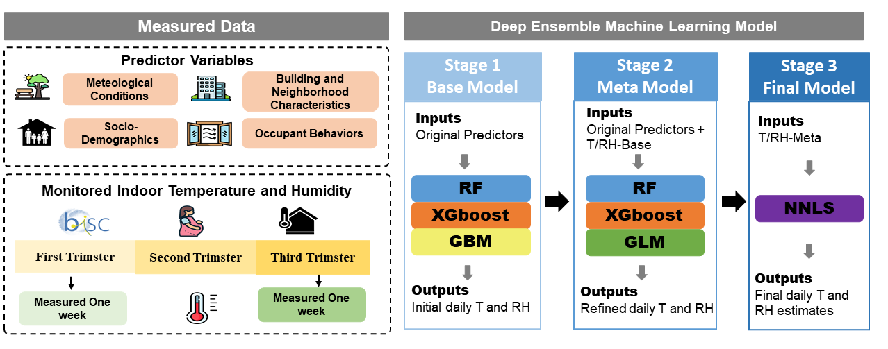

# DEML for daily indoor temperature and relative humidity in BiSC

Research code accompanying **Prediction of daily home indoor temperature and relative humidity using a deep ensemble machine learning approach**, published in *Building and Environment* (2026).

[Read the paper](https://doi.org/10.1016/j.buildenv.2026.114392)

## Overview

This repository contains the code for a **deep ensemble machine learning (DEML)** framework developed to predict **daily mean indoor temperature (°C) and relative humidity (%) throughout pregnancy** for participants in the **Barcelona Life Study Cohort (BiSC)**.

The framework combines bedroom monitoring data with outdoor meteorological conditions, housing and building characteristics, and occupant behaviours. Its purpose is to estimate indoor environmental exposures across pregnancy using measurements collected during limited monitoring periods.

The publicly available code covers **data cleaning and preparation, model development, validation, and the generation of figures and tables**.

> **Data availability:** Study data are not publicly available because of participant privacy and ethical restrictions. Reproducing the original BiSC analyses requires authorised access to the underlying data.

## Graphical abstract



## Repository organisation

| Folder | Contents |
| --- | --- |
| [`Process/`](Process/) | Data cleaning, organisation, and preparation of the datasets used for modelling |
| [`DEML/`](DEML/) | Four subfolders covering the temporal and spatial validation workflows and the simplified model, with associated analysis and visualisation code |

The four components within `DEML/` are described below.

| Component | Purpose |
| --- | --- |
| **Long-term temporal validation** | Evaluates prediction performance over longer time periods relevant to exposure assessment across pregnancy |
| **Short-term temporal validation** | Evaluates prediction performance over shorter time scales, including day-to-day variation in indoor conditions |
| **Spatial validation** | Evaluates prediction performance across homes |
| **Simplified model** | Uses outdoor meteorological data and basic characteristics available in the cohort, addressing settings without detailed building, indoor environment, or occupant behaviour information |

The first three components address validation. The simplified model is a separate modelling option defined by its reduced predictor set.

<!-- MAINTAINER NOTE
Replace the descriptive labels with links to the four actual subfolders when
their exact names are confirmed. Add script entry points and execution order
without renaming any existing files or directories.
-->

## Running the analysis

The scripts were developed for the BiSC study data. Running them requires the relevant input datasets, the dependencies used by the scripts, and correctly configured local file paths.

1. **Download or clone the repository.**

   ```bash
   git clone https://github.com/yuzhao-isg/DEML_indoor_model_BiSC.git
   cd DEML_indoor_model_BiSC
   ```

2. **Prepare the software environment and paths.** Install the dependencies referenced by the scripts and update input and output paths for your local environment.

3. **Prepare the input data.** Provide the indoor monitoring measurements and the corresponding predictor data. Check participant and home linkage, dates, measurement units, and variable coding against the requirements of the processing scripts.

4. **Run the data-processing workflow in `Process/`.** Clean and organise the source data, then construct the datasets required by the selected modelling workflow. Follow the dependencies between scripts so that intermediate datasets are available when needed.

5. **Run the relevant workflow in `DEML/`.** Select the model or validation component needed for your analysis and run its temperature and relative humidity analyses.

6. **Generate the analysis outputs.** Run the corresponding validation, plotting, and table-generation code after the required model results have been produced.

<!-- MAINTAINER NOTE
Before treating this section as a complete execution guide, add the software
and package versions, actual script filenames and run order, required input
file formats, and output locations. These details have not been verified
against the repository and are intentionally not guessed in this draft.
-->

## Data availability and reproducibility

**All underlying study data are excluded from the public repository** because of participant privacy and ethical restrictions. This includes the participant-level information needed to reproduce the original analyses.

The repository shares the analytical code from data preparation through modelling, validation, and figure and table generation. It supports inspection of the methods and adaptation of the workflows, but the public code alone is insufficient to reproduce the original BiSC results.

When adapting the code, document the software environment, data-processing decisions, predictor definitions, and validation design used in your analysis.

## Citation

If you use or adapt this code in research, please cite the associated publication:

**Zhao Y, et al.** Prediction of daily home indoor temperature and relative humidity using a deep ensemble machine learning approach. *Building and Environment*. **2026;295:114392**. [https://doi.org/10.1016/j.buildenv.2026.114392](https://doi.org/10.1016/j.buildenv.2026.114392)

Please also identify the version or commit of this repository used in your analysis.

## Contact

Maintainer: [Yu Zhao](https://github.com/yuzhao-isg).

For questions about the code, please open an [issue in this repository](https://github.com/yuzhao-isg/DEML_indoor_model_BiSC/issues).

<!-- MAINTAINER NOTE
Add a code-licence section only after the applicable licence has been
confirmed. This draft does not assign a licence or change reuse permissions.
-->
